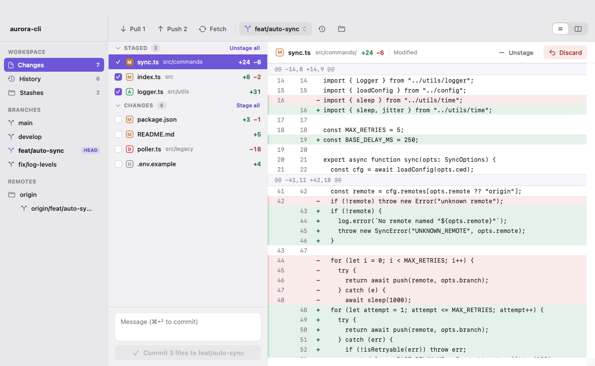
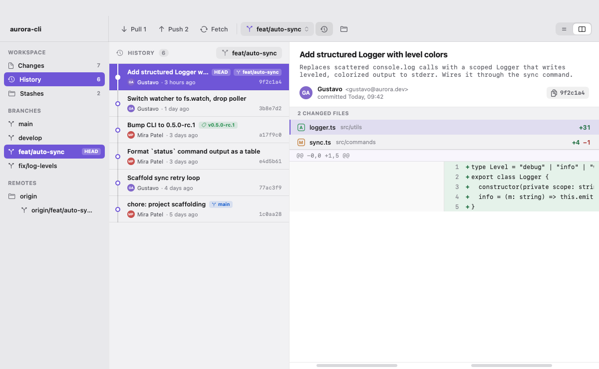
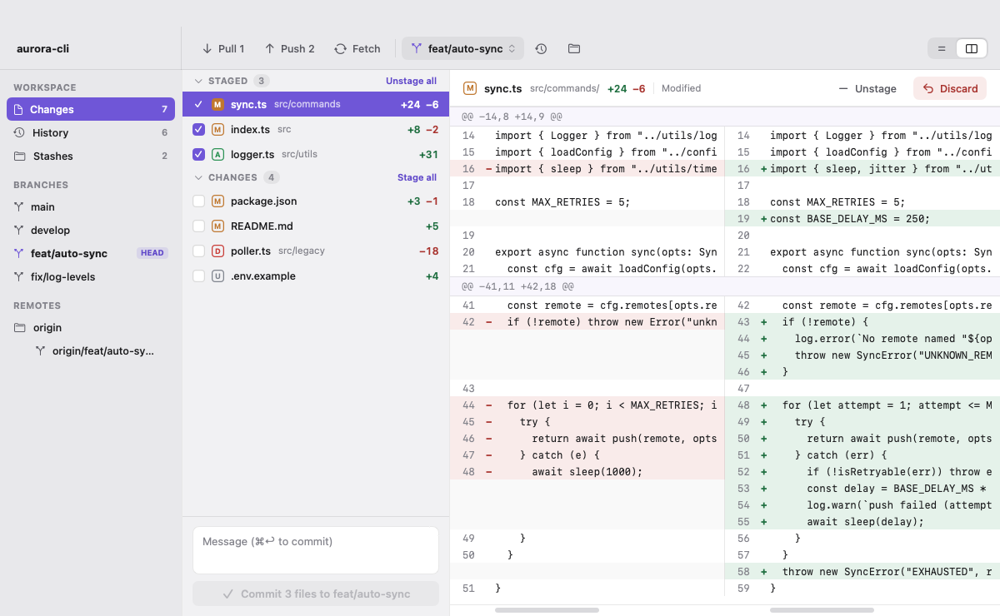
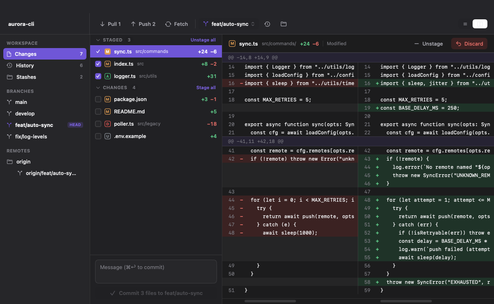

# GitWorkbench

A native **macOS git-changes UI** for SwiftUI — Changes, History, and Stash views with a full
unified/side-by-side diff renderer — shipped as a dependency-free Swift package. You supply the
repository data; GitWorkbench renders it and turns user actions back into calls you handle.



## What it is

GitWorkbench is a **UI + state** component: **it never runs `git` itself.** Your app (the *host*)
feeds it repository data and performs git operations through a single provider protocol. That keeps
the core library completely dependency-free and lets you back it with anything — the system `git`
CLI, libgit2, a remote API, or fixtures for SwiftUI previews.

The package ships two libraries:

- **`GitWorkbench`** — the SwiftUI component and its state store. **Zero dependencies.**
- **`GitWorkbenchGitKit`** — an optional, ready-made provider backed by the system `git` CLI (via
  Foundation `Process`). Pull it in and you have a working git UI in a few lines. It's a separate
  target on purpose, so UI-only consumers never pull a git backend.

### Features

- **Changes** — stage / unstage / discard, commit, unified **and** side-by-side diffs, live
  filesystem refresh.
- **History** — commit graph with refs, per-commit changed-files and diffs; single-click any branch
  to browse its history.
- **Stash** — apply / pop / drop.
- **Resizable columns** (persisted via a host-supplied store), **customizable light + dark themes**
  (swappable at runtime), and a draggable horizontal scroll for long diff lines.
- macOS 15+, Swift 6 (language mode v6).

## Screenshots

| History | Side-by-side diff |
| --- | --- |
|  |  |

Dark mode is built in (resolved from the SwiftUI color scheme):



## Installation

Swift Package Manager:

```swift
// Package.swift
dependencies: [
    .package(url: "https://github.com/gpambrozio/GitWorkbench.git", from: "1.0.0"),
    // …or a local checkout: .package(path: "../GitWorkbench"),
],
targets: [
    .target(name: "MyApp", dependencies: [
        "GitWorkbench",        // the UI component
        "GitWorkbenchGitKit",  // optional: the ready-made git-CLI provider
    ]),
]
```

## Quick start

### Real repository (using the bundled git-CLI provider)

```swift
import SwiftUI
import GitWorkbench
import GitWorkbenchGitKit

struct RepoView: View {
    @StateObject private var store = GitWorkbenchStore(
        provider: CLIGitProvider(repositoryURL: URL(fileURLWithPath: "/path/to/repo"))
    )

    var body: some View {
        GitWorkbenchView(store: store)   // loads on appear; that's a working git UI
    }
}
```

### SwiftUI previews (mock data, no repo needed)

```swift
#Preview { GitWorkbenchView(store: .preview) }   // backed by bundled fixtures
```

## How it works

`GitWorkbenchStore` is an `@MainActor` `ObservableObject` holding a single `WorkbenchState` value.
The views are a pure function of that state; user actions are **store intents** that optimistically
update the state and call your provider, rolling back (and surfacing a toast) on error. The whole
flow is unidirectional, and the only public view is `GitWorkbenchView(store:)`.

The host boundary is one protocol, `GitWorkbenchProvider`, composed of a read side and a write side:

```swift
public protocol GitWorkbenchDataSource: Sendable {     // reads
    func loadStatus() async throws -> RepositoryStatus
    func loadHistory(of ref: String?, before: Commit.ID?, limit: Int) async throws -> [Commit]
    func loadStashes() async throws -> [Stash]
    func loadBranches() async throws -> [Branch]
    func loadDiff(_ request: DiffRequest) async throws -> FileDiff
}

public protocol GitWorkbenchActionHandler: Sendable {  // writes
    func stage(_ files: [FileChange]) async throws
    func unstage(_ files: [FileChange]) async throws
    func discard(_ file: FileChange) async throws
    func commit(message: String, staged: [FileChange]) async throws -> Commit
    func pull() async throws -> SyncResult
    func push() async throws -> SyncResult
    func fetch() async throws -> SyncResult
    func switchBranch(to branch: Branch) async throws
    func applyStash(_ stash: Stash) async throws
    func popStash(_ stash: Stash) async throws
    func dropStash(_ stash: Stash) async throws
}
```

All provider methods are `async` and run off the main actor; the models are `Sendable` value types.
`CLIGitProvider` (in `GitWorkbenchGitKit`) is one implementation; conform your own type to
`GitWorkbenchProvider` to back the UI with libgit2, a service, etc.

## Configuration

Pass a `WorkbenchConfiguration` when creating the store:

```swift
var config = WorkbenchConfiguration()
config.initialView = .changes        // .changes | .history | .stashes
config.defaultDiffMode = .split      // .unified | .split
config.showsToolbar = true

let store = GitWorkbenchStore(provider: myProvider, configuration: config)
```

### Theming

Every color is a token on `WorkbenchTheme`. Recolor just the accent, override specific tokens, or
build one from scratch — for light and dark independently:

```swift
config.theme     = .standard.withAccent(.pink)        // light
config.darkTheme = .darkStandard.withAccent(.pink)    // dark

// override specific tokens (everything else falls back to the light identity):
config.theme = WorkbenchTheme(accent: .pink, winBg: .black)

// or follow the macOS system accent:
config.theme.adoptsSystemAccent = true
```

Themes can be swapped at runtime with no reload:

```swift
store.setTheme(light: .standard.withAccent(.green), dark: .darkStandard.withAccent(.green))
```

### Persisting column widths

The rail and list columns are draggable. To make widths survive relaunches, give the component a
`persistenceKey` and a `layoutStore` (you own the storage — UserDefaults, a file, iCloud, …).
Distinct keys give each embedding of the component its own saved layout:

```swift
config.persistenceKey = "main"
config.layoutStore = WorkbenchLayoutStore(
    load: { key in
        (UserDefaults.standard.dictionary(forKey: "columns.\(key)") as? [String: Double])?
            .mapValues { CGFloat($0) }
    },
    save: { key, widths in
        UserDefaults.standard.set(widths.mapValues { Double($0) }, forKey: "columns.\(key)")
    }
)
```

## Demo apps

Two runnable demos are included:

```bash
swift run GitWorkbenchDemo                    # mock-backed, no repo needed
swift run GitWorkbenchLiveDemo /path/to/repo  # real git via CLIGitProvider
```

`GitWorkbenchLiveDemo` is a full sample host: open a different repository (⌘O), switch sample themes
from the **Theme** menu, and watch it refresh live as the working tree changes on disk.

## Requirements

- macOS 15+
- Swift 6 / Xcode 16+

## Build & test

```bash
swift build
swift test
```
